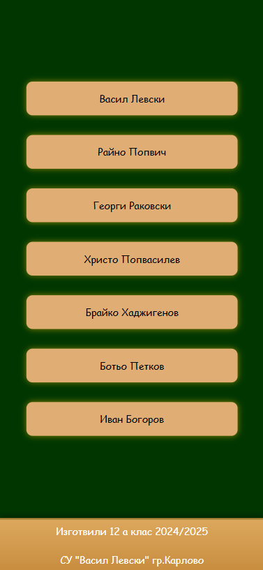
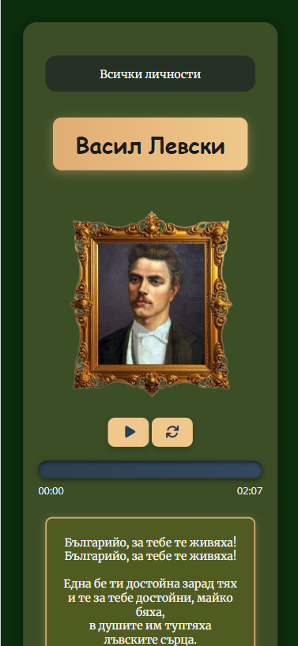

# 📜 National Heroes QR Code App — Documentation

## 1. Overview

The **National Heroes App** is a web-based platform for displaying information about Bulgarian national heroes.  
By scanning a QR code placed in the school of SU "Vasil Levski" in Karlovo, Plovdiv, Bulgaria, students can instantly access detailed information, images, and audio about each hero.

**Key features:**
- **Homepage** listing all heroes.
- **Detail page** with hero name, image, biography, and audio narration.
- **Audio controls** (play, pause, restart, progress tracking).
- **QR code support** for direct hero access.

---

## 2. Data Format

**`data.json`** (example):

```json
{
    "1": {
        "title": "Васил Левски",
        "avatar": "images/levski.jpg",
        "audio": "audio/levski.mp3",
        "text": "<p>Васил Левски е български революционер...</p>"
    },
    "2": {
        "title": "Христо Ботев",
        "avatar": "images/botev.jpg",
        "audio": "audio/botev.mp3",
        "text": "<p>Христо Ботев е български поет и революционер...</p>"
    }
}
```

---

## 3. Homepage Logic

**Script:** `homePageLoader.js`

- Fetches `data.json` using `fetch()`.
- Loops through heroes and creates clickable list items.
- Links follow the pattern:
  ```
  https://kiuliumov.github.io/nationalHero/?id={heroID}
  ```
- Adds a short delay before navigation for smoother UX.
- Gracefully handles missing `#heroesList` or fetch errors.

---

## 4. Detail Page Logic

**Script:** `onload.js`

**Workflow:**
1. Get the `id` parameter from the URL (`getIdFromUrl.js`).
2. Fetch hero data (`getdata.js`).
3. If `id` is missing → set default `id=1` and reload.
4. Populate:
   - **Title** (`#title`)
   - **Image** (`#placeholder-image`)
   - **Audio source** (`#audio`)
   - **Biography text** (`#text`)
5. Initialize audio controls.

---

## 5. Audio Controls

- **Play / Pause** — toggles audio playback.
- **Restart** — resets audio to the beginning.
- **Progress bar** — updates as the audio plays.
- **Time display** — current and total time shown in `MM:SS` format.
- If any audio-related element is missing, the script logs an error instead of breaking.

---

## 6. Helper Functions

### `getIdFromUrl.js`
Gets the hero ID from the query string:
```js
function getIdFromUrl(){
    const params = new URLSearchParams(window.location.search);
    return params.get('id');
}
```

### `generateUrl.js`
Creates a hero detail URL:
```js
function generateUrl(id){
    const url = new URL('http://127.0.0.1:5500/template.html');
    url.searchParams.append('id', id);
    return url.toString();
}
```

---

## 7. QR Code Integration

Each hero has a unique link with an `id`:
```
https://kiuliumov.github.io/nationalHero/?id=3
```
Generate a QR code for this link and place it in the school.  
Scanning the code opens the hero’s detail page directly.

---

## 8. Screenshots

### Homepage


### Detail Page


### Info Box

